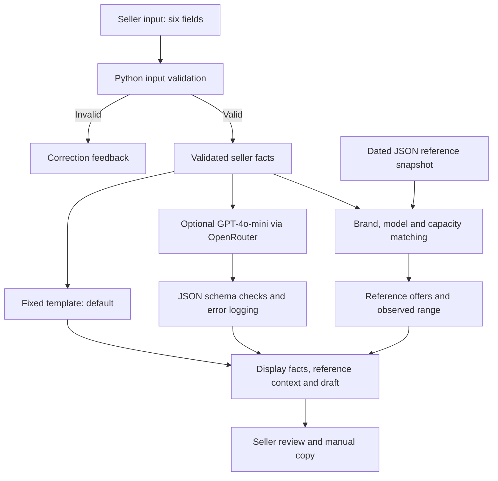

# Carousell AI Quick-Sell Assistant Product Documentation

## Persona and intended value

The primary users are international students and young working professionals in Singapore preparing second-hand listings when moving, graduating or leaving the country. They need useful price references and a clear description of their item. The prototype combines these preparation tasks in one notebook workflow. Easier preparation is an intended benefit; user time savings and faster sales have not been measured.

## Input and output

Input consists of six seller fields: `brand`, `model`, `specification` (storage), `condition`, `defects` and `accessories`. Conditions are `like_new`, `good`, `fair` or `poor`. Empty lists explicitly declare none; missing or null required information is rejected. The default example is synthetic.

For valid input, output includes seller facts, matching commercial offers and their observed min/max range where available, plus a template or AI-generated title and description. No matching offers means no range, while a valid draft can still be generated. Model/API errors are recorded. The seller reviews the wording, chooses a price and manually copies the draft to Carousell. No automatic posting or enforced approval gate is implemented.

## High level architecture

Only seller facts enter the model; merchant descriptions, prices and warranties do not. Retrieval and price-range calculation are deterministic. This is rule-based retrieval, not semantic RAG. Colab executes Python; GitHub distributes code and evidence. OpenRouter provides hosted inference through the OpenAI Python SDK. Carousell pages are manually collected sources, not a live tool integration.

## Code modules

| Notebook sections | Responsibility |
|---|---|
| 1 | Configuration and imports |
| 2–6 | Validation, synthetic development fixtures, template baseline and checks |
| 7–11 | Historical development evidence, model connection, generation and optional development evaluation |
| 12 | Reference snapshot loading and validation |
| 13–15 | Integrated workflow, display, demonstration and export |
| 16–18 | Integrated protocol, evaluator and evidence export |
| 19–21 | Supplementary dataset provenance, evaluator and export |

## Metrics targeted and reached

Targets below describe the implemented test expectations and intended product goals. They are not retroactively claimed as pre-registered aggregate KPIs. No numerical time-saving or sales target was established in the reviewed implementation evidence.

| Metric | Target or criterion | Recorded outcome |
|---|---|---|
| Invalid-input blocking | Reject each protocol-defined invalid input before generation | 3/3 per method on each set; zero requests for invalid inputs |
| Workflow correctness | Meet each frozen case's status, schema, matching/range and request-count expectations | L1 12/12 per method on both sets |
| Draft quality | Preserve supplied facts and required details; resist injected instructions; usable English | Integrated: template 8/9, LLM 9/9; supplementary: template 7/9, LLM 3/9 |
| Reference display | Show the recorded range for matching brand/model/capacity; no range for unmatched variants | Protocol checks passed; iPhone 13 128GB references span SGD 338–348 |
| API usage | Observe usage and constrain individual calls; no numerical deployment-cost target | Integrated LLM: 9 calls, 2,242 tokens; supplementary: 9 calls, 2,249 tokens |
| Latency | Observe generation time; no pre-set latency threshold | Integrated LLM: 1.134–4.865 seconds per call |
| Preparation effort | Make listing preparation easier | Not measured with users |
| Sale outcome | Support seller preparation and decision-making | Selling time and price accuracy not measured |

L1 is not a factual-accuracy score. Author review was AI-assisted, unblinded and retrospective. EXT-02 is borderline: changing that one judgment gives supplementary LLM 4/9. Sets are small and partly overlapping; they do not establish general superiority. Details are in [evaluation documentation](artifacts/README.md).

## Design decision and next steps

The template remains the default and optional AI writing requires seller checking. Validation, an input allowlist, restrictive prompts and output-schema checks are implemented, but unsupported claims and injection failures remain. Next steps are claim verification, an enforced review step and timed user tests. The three merchant offers provide context rather than private-sale valuations. Data scope and provenance are in [data documentation](data/README.md).
